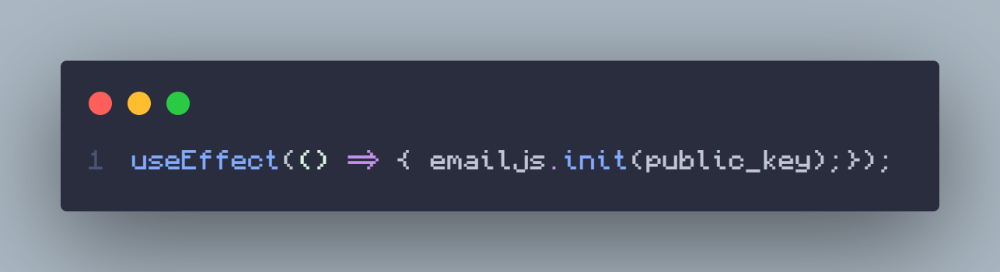
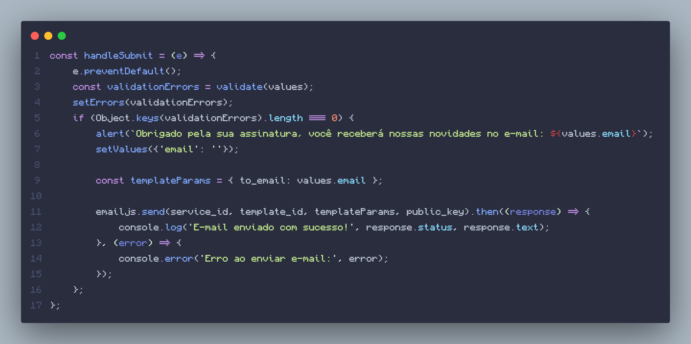

<h1 style="text-align:center;">Projeto de um E-commerce de Plantas</h1>

  Esse projeto esta sendo desenvolvido por mim (Tiago Monteiro) atráves do desafio <a href="https://7daysofcode.io/" target="_blank">#7DaysOfCode</a> da <a href="https://www.alura.com.br/" target="_blank">Alura</a>. 

  O Objetivo é criar essa página <a href="https://www.figma.com/design/0yOQR6fGtbdrmqeStiO0jf/7Days-React?node-id=0-1&node-type=canvas&t=mUwfhtndqnqkPjAj-0" target="_blank">Casa Verde</a>. 
   Aqui também irei fazer um <strong>log</strong> do desenvolvimento do projeto. Iniciei o projeto no dia 09/11/2024.

  Você pode ver o resultado do projeto até o momento clicando <a href="https://tiagomont.github.io/loja-planta/" target="_blank">aqui</a>.

<h2>Tecnologias usadas:</h2>

- <a href="https://vite.dev/" target="_blank">Vite + React</a>
- <a href="https://www.npmjs.com/" target="_blank">npm</a>
- <a href="https://sass-lang.com/" target="_blank">Sass</a>

<h1 style="margin-top: 40px;"> Daily Log</h1>

<h2>Dia 1 (09/11)</h2>

  No primeiro dia eu iniciei o projeto com o <strong>npm</strong>, e o primeiro desafio foi fazer o <strong>Menu</strong> e a <strong>Assinatura Newsletter</strong> usando os componentes do <strong>React</strong>.

  Primeiro eu fiz o componente Menu quebrando ele em 2 partes, o Menu em si e os MenuItem's. Logo em seguida eu fiz a estilização desses componentes e o corpo da página, inserindo a logo da loja e o background usando o Sass (pré-processador de CSS). 

  Depois eu fiz a sessão Newsletter quebrando em 2 partes também, o Newsletter em si e o Form (formulário simples de inscrição de e-mail). E em seguida também fiz a estilização dessa sessão.

<h2>Dia 2 (10/11)</h2>

  Hoje eu adicionei <strong>validação</strong> de email no formulário de inscrição da "Newsletter", usando <strong>React Hooks</strong>, especificamente o "useState".

  A validação é feita de forma dinâmica conforme o usuário digita o e-mail no campo, logo em seguida, a validação é feita verificando se o campo está vazio ou se o e-mail está escrito de forma correta, se estiver correto aparece um alerta de que o e-mail foi cadastrado, se não, mostra ao usuário o que está errado (mensagem de erro).

<h3>Como eu fiz a validação?</h3>

<h3 style="text-align: center;">Validação no React</h3>

A imagem abaixo mostra como eu fiz a validação de e-mail no React usando o React Hook (useState)

<h3 style="text-align: center;">"HTML" do Formulário</h3>

Já nessa imagem mostra como ficou a parte "HTML" do formulário

<h2>Dia 3 (13/11)</h2>

  Hoje eu fiz uma <strong>confirmação de e-mail</strong> da Newsletter usando uma <strong>API</strong> de envio de e-mail, o <strong>emailjs</strong>.

  Primeiro eu configurei o <strong>dotenv</strong> para a segurança de dados sensiveis (tokes da API) e depois utilizei as variaveis de tokens no componente <strong>Form</strong>. Então utilizei as funções da API para inicializa-la e configura-la. Veja nas imagens a seguir:

<h3 style="text-align: center;">Definindo as Variáveis</h3>

<h3 style="text-align: center;">Iniciando a API</h3>

<h3 style="text-align: center;">Implementação da API</h3>

<footer>
  
Feito por <a href="https://tiagomonteiro.dev">Tiago Monteiro</a>

</footer>

